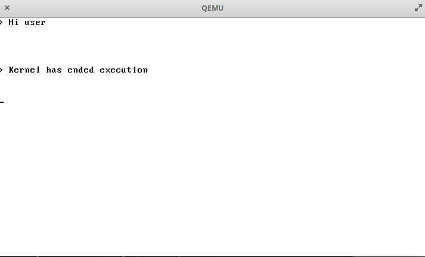

# SMOS
Small &amp; Modular x86 Operating System
## What is SMOS
It's an **unix-like** operating system, designed to be easily customizable by anyone to create its own OS. 
It supports pagination, is preemptive and small GUI system to create window(s) for your appplication(s).  
For now it is not usable and still in early development.

## What is working today ?
- Full protected mode GDT support, ring & dynamic gdt entries are working.
- Full interrupts (example clock & keyboard) support.
- Multitasking ! (Only for ring0 -> ring0, working on all ring multitasking)

## How to modify & build this project
### Memory organization
(Can change over time)  
0x1000: Kernel code 
0x7C00 Bootloader code 
0x90000 Kernel stack beginning 
### System call
All system calls are accessible to ring3 applications : 
**0x30** : Print DEBUG on top-left corner, can be used to debug.
**0x31** : Print DEBUG on top-right corner, can be used to debug.

### Build
**Linux distro** (arm, x86, whatever architecture you want) is almost mandatory. 
Just run the auto-build script, you may need to give it execution right. 
Don't forget to use a cross-compiler targeting raw i686/i386 code. 
Don't touch bootloaders & kernel files, you can edit : 
**Still in development, this rdme will be edited when time has come.**
